```mermaid
erDiagram
    %% ==================== EXISTING MODULES ====================
    
    CUSTOMERS {
        bigint id PK
        varchar username UK
        varchar email UK
        varchar doc_number UK
        varchar first_name
        varchar last_name
    }
    
    ORDERS {
        bigint id PK
        varchar order_number UK
        bigint customer_id FK
        order_status_enum status
        numeric total
        jsonb shipping_address
        timestamptz created_at
    }
    
    ORDER_ITEMS {
        bigint id PK
        bigint order_id FK
        bigint product_id FK
        bigint variant_id FK
        varchar sku
        integer quantity
        numeric unit_price
        numeric total
    }
    
    VARIANTS {
        bigint id PK
        bigint product_id FK
        varchar sku UK
        numeric price
        jsonb attributes
    }
    
    USERS {
        bigint id PK
        varchar username UK
        varchar email UK
        varchar first_name
        varchar last_name
    }
    
    WAREHOUSES {
        bigint id PK
        varchar code
        varchar name
        varchar ubigeo_id FK
    }
    
    STOCKS {
        bigint id PK
        bigint warehouse_id FK
        bigint variant_id FK
        integer quantity
        integer reserved_quantity
    }
    
    MOVEMENTS {
        bigint id PK
        bigint variant_id FK
        bigint warehouse_id FK
        integer quantity
        operation_type_enum operation_type
        varchar reference_table
        bigint reference_id
        bigint user_id FK
    }
    
    SHIPMENTS {
        bigint id PK
        varchar shipment_type
        bigint order_id FK
        bigint rma_id FK "NULLABLE"
        bigint shipping_method_id FK
        varchar tracking_number
        varchar status
    }
    
    %% ==================== NEW RMA MODULE ====================
    
    RMAS {
        bigint id PK
        varchar rma_number UK "RMA-2026-00001"
        bigint order_id FK
        bigint customer_id FK
        rma_status_enum status "DEFAULT PENDING"
        rma_reason_enum reason
        text customer_comments
        text staff_notes
        refund_method_enum refund_method
        numeric refund_amount
        numeric restocking_fee
        numeric shipping_cost_refund
        bigint approved_by FK
        timestamptz approved_at
        timestamptz received_at
        timestamptz refunded_at
        timestamptz closed_at
        timestamptz created_at
        timestamptz updated_at
    }
    
    RMA_ITEMS {
        bigint id PK
        bigint rma_id FK
        bigint order_item_id FK
        bigint variant_id FK
        integer quantity
        item_condition_enum item_condition "NULL until inspected"
        text inspection_notes
        numeric refund_amount
        boolean restock_approved
        bigint inspected_by FK
        timestamptz inspected_at
        timestamptz created_at
    }
    
    RMA_STATUS_HISTORIES {
        bigint id PK
        bigint rma_id FK
        rma_status_enum status
        text comments
        bigint created_by FK
        timestamptz created_at
    }
    
    %% ==================== RELATIONSHIPS ====================
    
    %% Customer → Orders → RMAs (1:N:N)
    CUSTOMERS ||--o{ ORDERS : "places"
    CUSTOMERS ||--o{ RMAS : "requests"
    ORDERS ||--o{ RMAS : "has returns"
    
    %% Orders → Order Items → RMA Items (1:N:N)
    ORDERS ||--|{ ORDER_ITEMS : "contains"
    ORDER_ITEMS ||--o{ RMA_ITEMS : "can be returned"
    
    %% RMAs → RMA Items (1:N)
    RMAS ||--|{ RMA_ITEMS : "contains"
    
    %% RMAs → Status History (1:N)
    RMAS ||--o{ RMA_STATUS_HISTORIES : "tracks changes"
    
    %% Variants → RMA Items (1:N)
    VARIANTS ||--o{ RMA_ITEMS : "identifies product"
    VARIANTS ||--o{ ORDER_ITEMS : "sold as"
    
    %% Users → RMAs (Staff Actions)
    USERS ||--o{ RMAS : "approves (approved_by)"
    USERS ||--o{ RMA_ITEMS : "inspects (inspected_by)"
    USERS ||--o{ RMA_STATUS_HISTORIES : "creates (created_by)"
    
    %% Logistics: Shipments ↔ RMAs (N:1)
    SHIPMENTS }o--|| RMAS : "return shipment (INBOUND)"
    SHIPMENTS }o--|| ORDERS : "original shipment (OUTBOUND)"
    
    %% Inventory: RMA Items → Movements (for restock)
    RMA_ITEMS ||--o{ MOVEMENTS : "creates RETURN movement"
    MOVEMENTS }o--|| VARIANTS : "affects stock"
    MOVEMENTS }o--|| WAREHOUSES : "at location"
    MOVEMENTS }o--|| USERS : "performed by"
    
    %% Inventory: Stocks
    WAREHOUSES ||--o{ STOCKS : "holds"
    VARIANTS ||--o{ STOCKS : "stored"
```

**LEYENDA:**

**Estados de RMA (rma_status_enum):**
```
PENDING → APPROVED → IN_TRANSIT → RECEIVED → INSPECTING → REFUNDED → CLOSED
         ↓ REJECTED
         ↓ CANCELLED
```

**Tipos de Shipments:**
- **OUTBOUND:** Empresa → Cliente (orden original) → `order_id != NULL, rma_id = NULL`
- **INBOUND:** Cliente → Empresa (devolución) → `order_id = NULL, rma_id != NULL`

**Relación con Inventory:**
```
RMA Item (restock_approved = true)
    ↓
Movement (operation_type = 'RETURN', reference_table = 'rma_items', reference_id = rma_items.id)
    ↓
Stock (quantity += movement.quantity)
```

**Flujo Completo:**
```
1. Cliente → Crea RMA (PENDING)
2. Staff → Aprueba (APPROVED) o Rechaza (REJECTED)
3. Cliente → Envía paquete (IN_TRANSIT)
4. Warehouse → Recibe (RECEIVED)
5. Staff → Inspecciona items (INSPECTING)
   - Evalúa condición (item_condition)
   - Decide si restock (restock_approved)
   - Calcula refund_amount ajustado
6. Sistema → Procesa reembolso (REFUNDED)
7. Sistema → Actualiza inventario si restock_approved
8. Staff → Cierra RMA (CLOSED)
```
